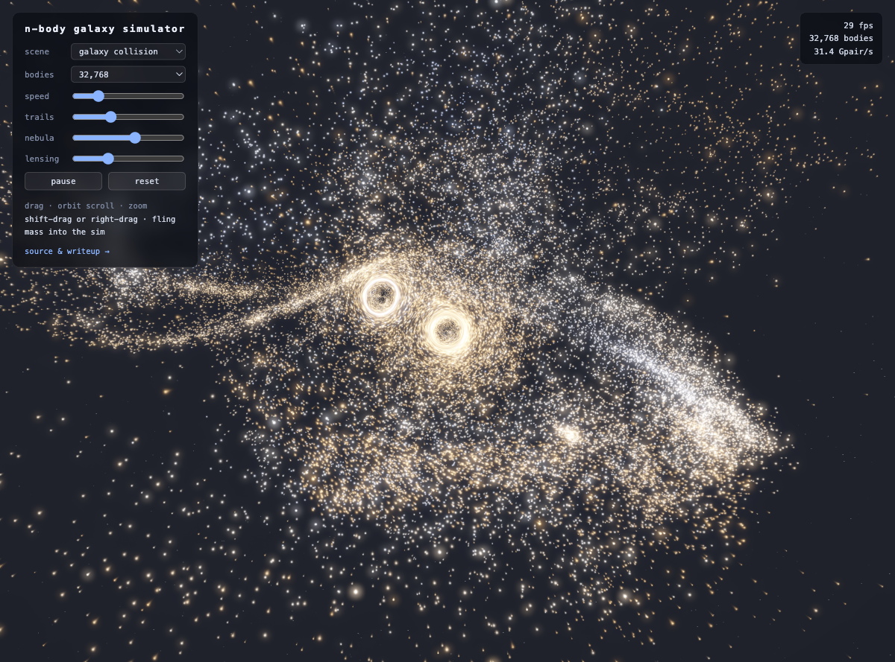
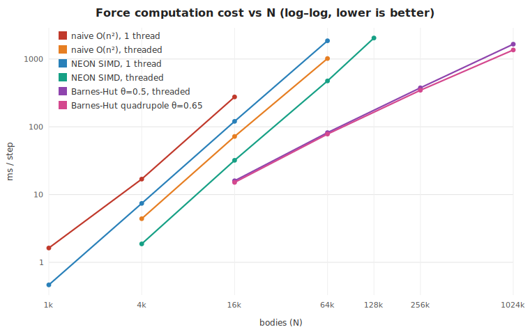
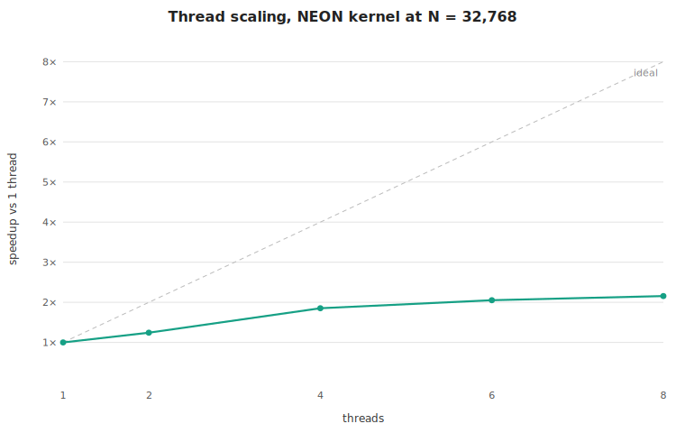

# N-Body Galaxy Simulator

Real-time gravitational simulation, twice: a CPU engine in C++ pushed from a
naive O(n²) loop to a multithreaded, NEON-vectorized Barnes-Hut tree with
quadrupole moments that steps **a million bodies in ~1.4 s**, and a WebGPU
compute demo that runs tens of thousands of bodies at 60 fps **entirely in
your browser** — fling mass into a galaxy collision and watch it evolve.

**[▶ Live demo](https://taf0711.github.io/nbody-galaxy-sim/)** — needs WebGPU
(Chrome, Edge, or Safari 18+). Drag to orbit, scroll or pinch to zoom,
**shift-drag (or right-drag) to fling mass into the simulation**, and play
with the trails, nebula (ray-marched volumetrics) and lensing (gravitational
light bending) sliders.



## The optimization story

Same physics at every step — softened gravity, kick-drift-kick leapfrog —
measured at n = 16,384 on an Apple M2 (4P+4E cores, clang -O3, no fast-math):

| stage | ms/step | speedup |
|---|---:|---:|
| naive all-pairs, scalar, 1 thread | 276.0 | 1.0× |
| + thread pool (8 threads) | 72.0 | 3.8× |
| NEON SIMD kernel, 1 thread | 120.2 | 2.3× |
| SIMD + threads | 32.0 | 8.6× |
| Barnes-Hut θ = 0.5 + threads | 16.0 | 17.3× |
| **Barnes-Hut quadrupole θ = 0.65** | **15.1** | **18.3×** |



The brute-force curves grow as n²; Barnes-Hut grows as n·log n. The gap is
already ~6× at 65k bodies and grows without bound:

| N | BH monopole θ=0.5 | BH quadrupole θ=0.65 | all-pairs SIMD+threads |
|---:|---:|---:|---:|
| 65,536 | 81.9 ms | 78.1 ms | 476 ms |
| 262,144 | 376 ms | 346 ms | ~8,200 ms (extrapolated) |
| 1,048,576 | 1,658 ms | 1,360 ms | ~131,000 ms (extrapolated) |

At a million bodies the tree build (Morton sort + construction) is only
~95 ms of the step — traversal dominates, which is exactly where you want
the time going.



Two honest footnotes that took debugging to learn:

* The "naive scalar" baseline is not as naive as it looks — clang
  auto-vectorizes it to ~1 G pair-interactions/s. The hand-written kernel's
  2.3× on top comes from what the compiler *won't* do without
  `-ffast-math`: replacing `sqrt + divide` with NEON's reciprocal-sqrt
  estimate plus two Newton-Raphson steps, and running four independent
  accumulator streams so the latency chains overlap.
* Thread scaling tops out at ~3.6×, almost all of it from the four P-cores.
  And on macOS, two things will silently wreck a parallel benchmark:
  worker threads without an explicit QoS class can get parked on E-cores,
  and Low Power Mode caps the whole pool at ~2× while single-thread numbers
  look normal. (Full data: [bench/results.md](bench/results.md).)

## How it works

**Physics.** Plummer-softened gravity (G = 1), kick-drift-kick leapfrog.
Leapfrog is symplectic — energy errors stay bounded instead of accumulating —
and softening makes the i = j self-interaction term exactly zero, so every
inner loop is branch-free: no `if (i != j)`, no special cases, just FMAs.

**SIMD kernel** (`src/nbody/forces_simd.cpp`). Bodies live in
structure-of-arrays layout so `vld1q_f32` grabs four bodies per instruction.
The core trick:

```c++
// ~8 valid bits from the estimate; each Newton-Raphson step doubles that.
inline float32x4_t rsqrt_nr2(float32x4_t v) {
  float32x4_t e = vrsqrteq_f32(v);
  e = vmulq_f32(e, vrsqrtsq_f32(vmulq_f32(v, e), e));
  e = vmulq_f32(e, vrsqrtsq_f32(vmulq_f32(v, e), e));
  return e;
}
```

That chain is ~7 dependent ops, so one stream leaves the M2's four NEON pipes
mostly idle — the kernel processes four j-blocks in flight with independent
accumulators, which is worth as much as the vectorization itself.

**Thread pool** (`src/nbody/thread_pool.h`). Chunked dynamic parallel-for:
threads pull ranges off a shared atomic cursor, so uneven work (tree
traversal depth varies per body) balances itself. The calling thread
participates, and workers pin their QoS class so the macOS scheduler keeps
them on performance cores.

**Barnes-Hut** (`src/nbody/barnes_hut.cpp`). Not a pointer octree: each step,
bodies are sorted by 63-bit Morton code and the tree is built by recursively
splitting code ranges on 3-bit digits. Every node's bodies are then a
*contiguous range* of the sorted arrays, which buys three things:

1. leaf interactions run through the same NEON kernel shape as brute force,
2. children sit after parents in one flat array, so centers of mass are
   computed in a single reverse sweep with no recursion,
3. bodies in Morton order make near-identical tree walks, so the parallel
   traversal stays cache-friendly.

A body never approximates a node it is inside (that would add a spurious
self-force through the node's center of mass) — and setting θ = 0 forces the
tree to degenerate into exact all-pairs, which is the test that catches any
lost or double-counted body in the partition logic.

On top of the monopole approximation, each node optionally carries a
traceless quadrupole tensor Q_ij = Σ m (3 sᵢsⱼ − s²δᵢⱼ) about its COM.
Children fold into parents with the parallel-axis shift — exactly, because
the cross terms vanish about each child's own COM. One extra power of s/d in
the error means ~4× better accuracy at fixed θ, so θ can be opened up:

| configuration | RMS force error | ms/step @ 16k | @ 1M |
|---|---:|---:|---:|
| monopole θ = 0.5 | 3.3 × 10⁻³ | 16.0 | 1,658 |
| monopole θ = 0.75 | 1.1 × 10⁻² | — | — |
| quadrupole θ = 0.5 | 8.6 × 10⁻⁴ | — | — |
| **quadrupole θ = 0.65** | **2.8 × 10⁻³** | **15.1** | **1,360** |

Equal accuracy, ~20% faster at a million bodies (the win grows with N as
node acceptances dominate leaf work) — or 4× the accuracy at equal cost.

**WebGPU demo** (`web/`). The same KDK scheme in WGSL. The force pass is the
classic tiled all-pairs kernel: 256-thread workgroups stage 256-body tiles
through workgroup memory, so each global position is read once per workgroup
instead of once per thread — the M2's GPU sustains ~64 billion
pair-interactions/s, ~6× the full 8-thread CPU SIMD rate. Rendering:
additive gaussian sprites in HDR (rgba16float), per-star hashes varying
size, brightness and hue (with a sprinkling of rare bright stars), each
galaxy and any visitor-flung mass tinted as its own population, a half-res
two-pass gaussian bloom, optional motion trails (the HDR buffer multiplied
by a blend constant each frame), and an exponential-tonemap composite over a
procedural background starfield. No build step, no dependencies — ES modules
and WGSL strings.

Why brute force on the GPU instead of porting Barnes-Hut? Divergent tree
traversal is a poor fit for lockstep GPU execution, and at the body counts a
web page wants (≤131k), tiled brute force already saturates the ALUs while
staying simple enough to verify. The algorithmic story lives in the CPU
phases; the GPU's job is to be fast and beautiful.

**Ray tracing.** Two ray techniques sit on top of the sprite renderer:

* *Volumetric nebula* — every frame a compute pass deposits particle mass
  into a 96³ density grid (fixed-point `atomicAdd`, since WGSL has no float
  atomics), a second pass converts it to a filterable 3D texture, and a
  half-resolution pass ray-marches camera rays through it with emission and
  absorption (64 jittered steps, front-to-back, early-out when opaque). The
  gas you see is the actual simulated mass distribution, glowing indigo →
  teal → gold with density.
* *Gravitational lensing* — the composite pass bends rays around the two
  galactic cores using the point-mass thin-lens equation β = θ − θ²ᴱ/θ,
  warping the rendered scene **and** the background starfield into arcs and
  Einstein rings. Core positions are read back from the simulation buffer
  each frame, so the lenses ride along as the cores orbit and merge. (The
  deflection strength is stylized — a real galactic core would warp far less
  at this scale — but the optics are the real equation.)

## Correctness

`make test` — every optimized path is validated against the naive reference,
and the physics against analytic behavior:

* two-body circular orbit: radius drift < 2 × 10⁻⁵ over 5 orbits
* Plummer sphere energy conserved to |ΔE/E| ~ 10⁻⁷ over 200 steps,
  momentum to ~10⁻⁹
* SIMD vs naive: max relative error 2 × 10⁻⁶
* threaded vs serial: bitwise identical
* Barnes-Hut θ = 0 vs naive: exact (tree partition correctness)
* quadrupole accuracy at θ = 0.5 and θ = 0.65 vs naive
* Barnes-Hut θ = 0.7 energy conserved to ~10⁻⁵ over 100 steps

## Build & run

```sh
make test                        # build + physics test suite (~10 s)
make bench                       # full benchmark sweep -> bench/results.csv
python3 tools/plot_bench.py      # regenerate charts + bench/results.md
cd web && python3 -m http.server # demo at http://localhost:8000
```

Requires clang++ on Apple Silicon (NEON intrinsics) and any Python 3 for the
charts. The web demo is static files — host it anywhere.

## Possible next steps

* Fast multipole method (FMM) for O(n) forces — the natural sequel to
  quadrupole Barnes-Hut.
* Parallel radix sort for the Morton codes once traversal stops dominating.
* A WASM + SIMD build of the CPU engine, so the Barnes-Hut path runs in the
  browser too and the demo can scale past brute force.
* GPU tree traversal (persistent threads + work queues) for millions of
  bodies in the demo.

## Hardware

All numbers: Apple M2 (MacBook Air, 4 performance + 4 efficiency cores),
Apple clang 17, `-O3` without `-ffast-math`, macOS Low Power Mode off, on a
cool idle machine — sustained all-core NEON heats a fanless laptop enough to
throttle within minutes, which is itself a benchmarking lesson.
